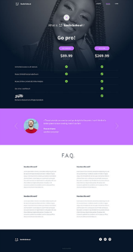

<h1 align="center">Holberton Smiling School Javascript</h1>

<p align="center">
  
</p>

### Description
- This project is part of Holberton School Front-end curriculum
- it's also a completion of [Holberton-Smiling-School](https://github.com/khaldi505/holberton-smiling-school)
- In the previous project i made the HTML structure with accessibility in mind
- Added style to the website to match the expected result and to be responsive on any screen size (mobile, tab, desktop) using mainly Bootstrap and CSS

### Screenshots




### Requirements
    You have to use Bootstrap
    For this project, you will need: fonts from Google, JQuery, Bootstrap CSS/JS
    Your styles.css must be as small as you can - you must use as much as you can Bootstrap classes
    You have to use JQuery
    Your scripts.js must contain all your Javascript part
    Your Javascript must be executed only when the document is loaded

### Imports
```html
<link href="https://fonts.googleapis.com/css?family=Source+Sans+Pro&display=swap" rel="stylesheet">
<link href="https://fonts.googleapis.com/css?family=Coiny&display=swap" rel="stylesheet">

<script src="https://code.jquery.com/jquery-3.4.1.min.js" integrity="sha256-CSXorXvZcTkaix6Yvo6HppcZGetbYMGWSFlBw8HfCJo=" crossorigin="anonymous"></script>
<script src="https://stackpath.bootstrapcdn.com/bootstrap/4.4.1/js/bootstrap.min.js" integrity="sha384-wfSDF2E50Y2D1uUdj0O3uMBJnjuUD4Ih7YwaYd1iqfktj0Uod8GCExl3Og8ifwB6" crossorigin="anonymous"></script>
<script src="https://cdnjs.cloudflare.com/ajax/libs/popper.js/1.12.9/umd/popper.min.js" integrity="sha384-ApNbgh9B+Y1QKtv3Rn7W3mgPxhU9K/ScQsAP7hUibX39j7fakFPskvXusvfa0b4Q" crossorigin="anonymous"></script>

<link rel="stylesheet" href="https://stackpath.bootstrapcdn.com/bootstrap/4.4.1/css/bootstrap.min.css" integrity="sha384-Vkoo8x4CGsO3+Hhxv8T/Q5PaXtkKtu6ug5TOeNV6gBiFeWPGFN9MuhOf23Q9Ifjh" crossorigin="anonymous">

<link rel="stylesheet" href="styles.css">
<script src="scripts.js"></script>

```
